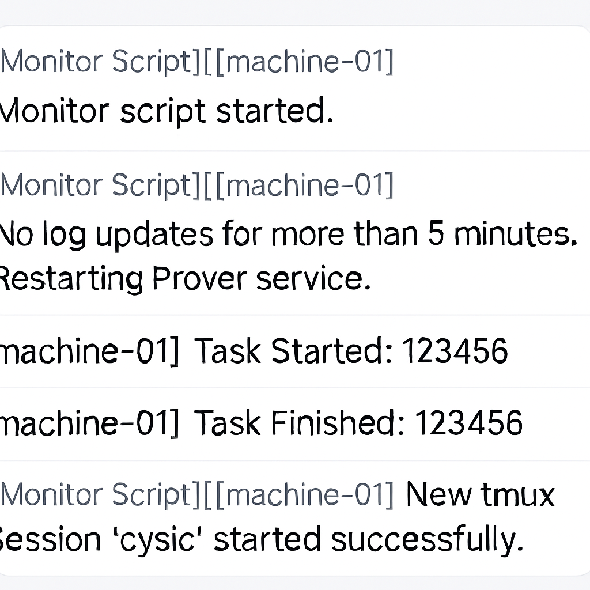

# Cysic Prover Monitor



This project provides two shell scripts to **run and monitor a Cysic Prover process** inside a `tmux` session, with **automatic restart** and **Feishu (Lark) webhook notifications**.

---

## 📌 Features

### 1. `start2.sh` – Prover Runner Script
- **Purpose:** Starts the Cysic Prover with the necessary environment variables.
- **Logging:**
  - Outputs prover logs to `/var/log/prover.log`.
  - Automatically trims the log file to the last **100,000 lines** to prevent excessive disk usage.
- **Task Tracking:**
  - Detects when a prover task starts or finishes and sends notifications to Feishu.
- **Error Handling:**
  - Watches for fatal errors in prover output (e.g., TLS errors, execution failures).
  - Sends a Feishu alert and terminates itself when critical errors occur.
- **Feishu Notifications:**
  - Customizable `WEBHOOK_URL` for Feishu bot integration.
  - Optional `MACHINE_ID` for identifying the machine in notifications.

---

### 2. `cysic-prover-monitor.sh` – Prover Monitor Script
- **Purpose:** Monitors the prover log file and automatically restarts the prover if no new log entries are detected for a set time.
- **How it works:**
  1. Checks `/var/log/prover.log` every `CHECK_INTERVAL` seconds (default: 60).
  2. If there’s no log update for `TIMEOUT` seconds (default: 300), it:
     - Stops the current `tmux` session running the prover.
     - Waits 30 seconds.
     - Starts a new `tmux` session and runs `start2.sh`.
     - Waits an additional 2 minutes before resuming monitoring.
- **Session Management:**
  - Uses `tmux` to run prover in a background session (`SESSION_NAME`, default: `cysic`).
  - Kills old sessions before creating new ones.
- **Feishu Notifications:**
  - Alerts on script start, prover restarts, and errors.
  - Can use the same `MACHINE_ID` as `start2.sh`.

---

## 🛠 Requirements
- **tmux** (check with `which tmux`)
- **curl** (for Feishu webhook notifications)
- Cysic Prover binary and dependencies in `/root/cysic-prover`
- Linux environment with bash

---

## 🚀 Installation & Usage

### 1. Place Scripts
```bash
cd /root/cysic-prover
# Place start2.sh here
chmod +x start2.sh

# Place cysic-prover-monitor.sh anywhere (e.g., /root/)
chmod +x /root/cysic-prover-monitor.sh
/root/cysic-prover-monitor.sh
